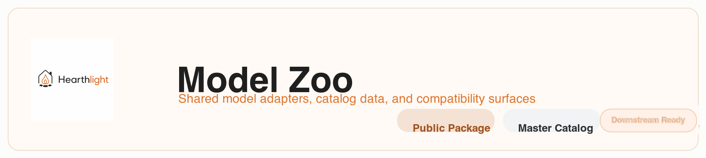

# Hearthlight Model Zoo

`hearthlight_model_zoo` is the shared package for Hearthlight model adapters, catalog data, and compatibility surfaces.

It keeps the model-management layer easy to import and easy to extend:

- one installable Python package
- one public import surface for detectors, trackers, embeddings, pose, and anomaly helpers
- one shipped master catalog that downstream repos can scan and merge with local registrations
- no checkpoint binaries committed to Git

## What This Repo Is

This repository is the public-facing home for the commodity model stack used by Hearthlight. It packages:

- runtime adapters such as `Detector`, `get_tracker`, `FeatureExtractor`, and `PersonReIDBundle`
- a shared model inventory in `src/hearthlight_model_zoo/master_catalog.json`
- artifact metadata in `src/hearthlight_model_zoo/artifacts.py`
- tests that keep the public API and catalog helpers stable

Weights and checkpoints are expected to be resolved at runtime into `~/.cache/hearthlight_model_zoo` or a configured cache directory.

## Quick Start

Install from GitHub:

```bash
python -m pip install "git+https://github.com/lauretta-io/hearthlight_model_zoo.git"
```

Or install locally while developing:

```bash
python -m pip install -e ".[dev]"
```

Basic imports:

```python
from hearthlight_model_zoo.detectors import Detector
from hearthlight_model_zoo.trackers import get_tracker
from hearthlight_model_zoo.feature_extractors import FeatureExtractor
from hearthlight_model_zoo.reid import PersonReIDBundle
from hearthlight_model_zoo.pose import PoseDetector
from hearthlight_model_zoo.anomaly_detectors import AnomalyDetector
```

Minimal usage:

```python
from hearthlight_model_zoo.detectors import Detector
from hearthlight_model_zoo.trackers import get_tracker

detector = Detector("yolox-s")
tracker = get_tracker("bytetrack")
```

## Stable Import Surface

The package currently exposes these public entrypoints:

- `hearthlight_model_zoo.detectors.Detector`
- `hearthlight_model_zoo.trackers.get_tracker`
- `hearthlight_model_zoo.feature_extractors.FeatureExtractor`
- `hearthlight_model_zoo.reid.PersonReIDBundle`
- `hearthlight_model_zoo.pose.PoseDetector`
- `hearthlight_model_zoo.anomaly_detectors.AnomalyDetector`

The runtime behavior is compatibility-first:

- detector outputs are normalized to Hearthlight task names such as `PERSON` and `BAG`
- `GUN` is intentionally not supported in the commodity detector lane
- pose and anomaly helpers degrade cleanly when optional runtime dependencies or cached artifacts are unavailable

## Current Model Families

The current shared inventory includes:

- detectors: `yolox-nano`, `yolox-tiny`, `yolox-s`, `yolox-m`
- trackers: `bytetrack`, `bytetrack-s`, `bytetrack-balanced`, `botsort`, `ocsort`, `strongsort`, `cmtrack`
- reid and feature extraction: `transreid-market1501`, `transreid-msmt17`
- pose: `rtmo-s`, `rtmo-m`
- anomaly stage 1 heuristic: `heuristic-presence`

## How The Master Catalog Works

The shared catalog lives in `src/hearthlight_model_zoo/master_catalog.json`.

Think of it as the package-shipped source of truth for:

- shared runtime registrations
- stage-specific model options
- default metadata that downstream apps can read without scraping docs

Downstream repos can load it directly through the package helper:

```python
from hearthlight_model_zoo.catalog import load_master_catalog

catalog = load_master_catalog()
```

That catalog ships with the package, so consumers can scan it after installation without copying registry files around.

## Using It In A Downstream Repo

The intended pattern is:

1. install `hearthlight_model_zoo`
2. read the shipped master catalog
3. merge in local-only registrations, overrides, or deployment defaults
4. keep local keys authoritative when a downstream repo needs custom behavior

This is the pattern used by `hearthlight` itself: shared catalog data comes from this package, while repo-local YAML or runtime config can extend it for product-specific behavior.

## Contributing

If you want to add a model family, adjust shared registrations, or improve the docs, start with [CONTRIBUTING.md](CONTRIBUTING.md).

That guide covers:

- when to edit `master_catalog.json`
- when to update `artifacts.py`
- how to keep README examples and catalog entries aligned
- the lightweight validation steps to run before opening a PR
